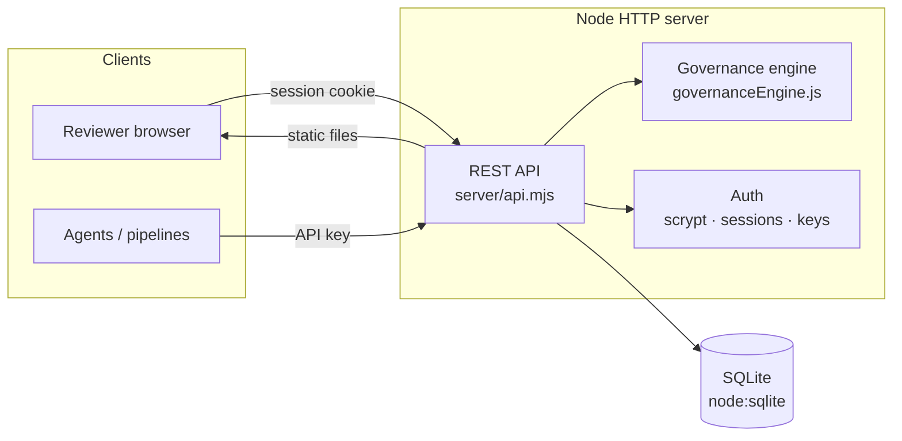
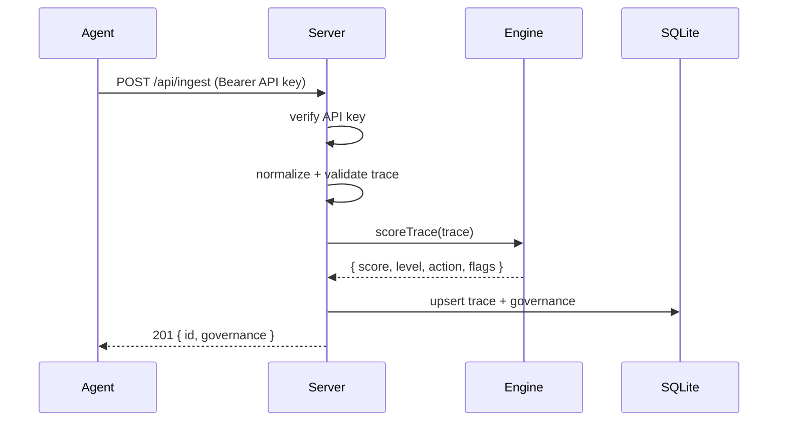
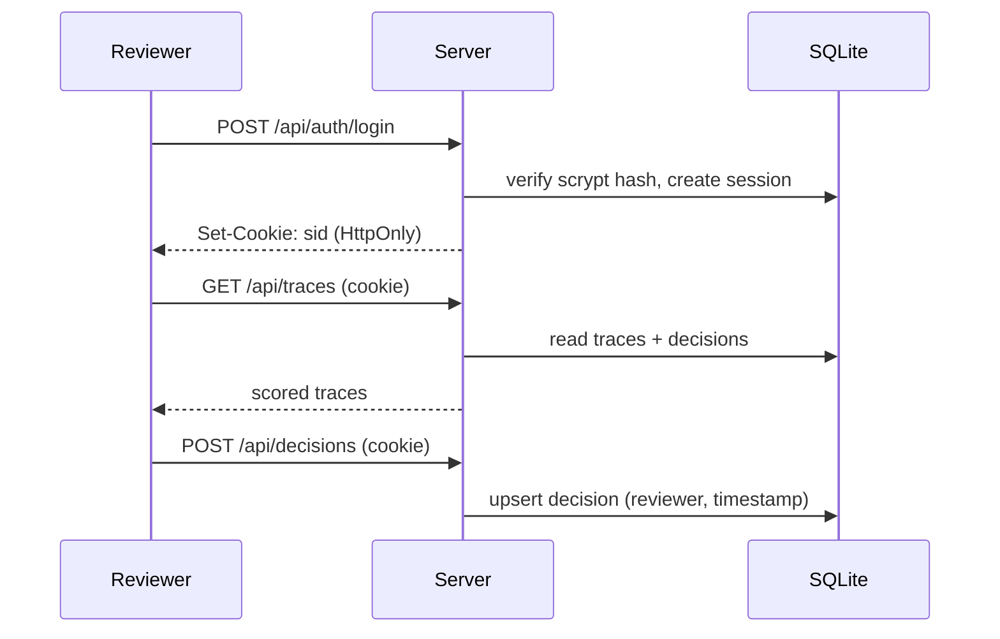

# Architecture

A three-tier application with **no external runtime dependencies** — the entire
backend runs on the Node standard library (`http`, `node:sqlite`, `node:crypto`).

## Components

| Layer | File(s) | Responsibility |
| --- | --- | --- |
| HTTP server | `server/index.mjs` | Routing, static file serving, boot |
| REST API | `server/api.mjs` | Endpoints, auth gating, JSON I/O |
| Auth | `server/auth.mjs` | scrypt password hashing, session cookies, API keys |
| Persistence | `server/db.mjs` | SQLite schema + prepared queries |
| Ingestion | `server/traces.mjs` | Validate + normalize + score incoming traces |
| Bootstrap | `server/bootstrap.mjs` | First-run admin, API key, sample seeding |
| Governance engine | `public/js/governanceEngine.js` | Rules + scoring (shared) |
| Dashboard | `public/*.html`, `public/js/*` | Login + reviewer UI |

**The governance engine is a single module** imported by the server (scores on
ingestion), the browser (renders the dashboard), and the test suite. There is one
source of truth for risk, so the UI can never diverge from what is stored or what
the tests verify.

## Request flow

**Ingestion (agent → service):**

**Review (human → service):**

## Data model

SQLite tables (`server/db.mjs`):

- **traces** — the ingested run plus denormalized governance (`score`, `level`,
  `action`, `flags`). Tool lists and retrieved content are JSON columns.
- **decisions** — one row per trace: `status` (approved/rejected/escalated),
  `note`, `reviewer`, `timestamp`. `ON DELETE CASCADE` with `traces`.
- **users** — `username`, scrypt `password_hash`, `role`.
- **sessions** — opaque `token`, `user_id`, `expires_at`.
- **api_keys** — ingestion keys.

Reset the system by deleting `DB_PATH` (or the `data/` directory).

## The policy engine

Each rule is `{ id, label, category, weight, severity, test(trace) }`.
`scoreTrace()` runs every rule, sums the weights of those that fire (capped at
100), and derives a **level** (High/Medium/Low) and **action**
(Escalate/Review/Monitor) from `THRESHOLDS`. A malformed trace can never crash
scoring — each rule's `test` is wrapped so a throw is treated as "did not fire".

- **Direct injection** scans the user input for override phrases.
- **Indirect injection** scans `retrievedContent` — modelling poisoned documents
  or tool output, where the malicious instruction rides in on retrieved data.
- **Sensitive data** fires on an explicit flag, keywords, or a bare email address.

## Human-approval model

Automated scoring and human judgement are deliberately separate:

- The **risk score** reflects *what the agent did* — evidence; it never changes
  because someone clicked a button.
- The **decision** reflects *what a human concluded* — persisted with reviewer and
  timestamp.

A trace is in the **approval queue** when `approvalRequired` is true and no
decision exists. In production this is the gate that would hold a *write* tool
until the decision is recorded.

## Audit model

`GET /api/audit` returns a self-contained evidence bundle: `generatedAt`,
`generatedBy`, the aggregate `summary`, and every trace with three layers —
**what happened** (the trace), **how it scored** (governance), and **who decided
what** (decision). That is exactly what an auditor needs to reconstruct events.

## Security notes

- Passwords hashed with **scrypt** + per-user salt; verification is
  constant-time.
- Sessions are opaque 256-bit random tokens in `HttpOnly`, `SameSite=Lax`
  cookies with a TTL; expired sessions are cleaned up on use.
- Ingestion is separated from the reviewer surface by a distinct **API-key**
  credential.
- Static file serving is contained to `public/` (path-traversal is blocked).
- Terminate TLS at a reverse proxy in production.

## Extending toward larger deployments

- Swap the SQLite layer (`server/db.mjs`) for Postgres behind the same API.
- Add RBAC roles (reviewer / approver / auditor) on top of the existing `role`
  column and session model.
- Add native ingestion adapters for OpenTelemetry / MLflow / Azure AI Foundry
  (see the [observability mapping page](public/mapping.html)).
- Move rules to versioned policy-as-code with a review workflow.
